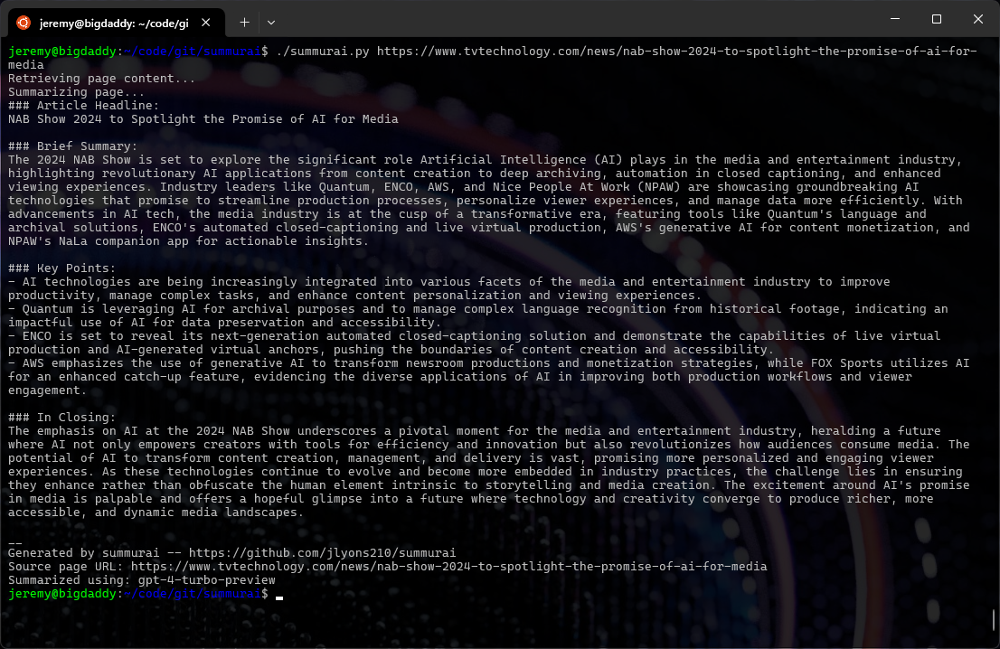
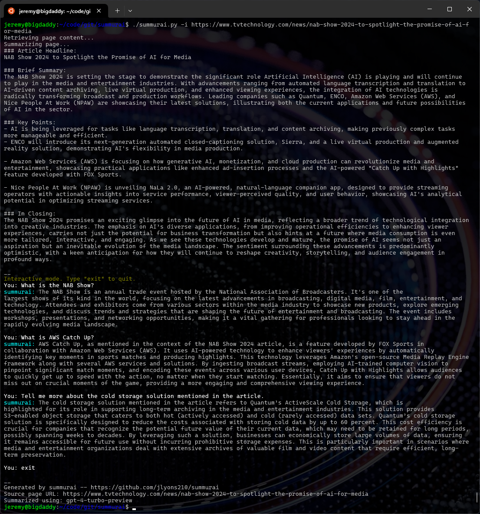

# summurai
Have you ever wanted a tool to get the [tl;dr](https://www.merriam-webster.com/dictionary/TL%3BDR) of a long webpage or article? How about one better: the ability to discuss and ask questions about the content?

**summurai** fetches and summarizes a webpage using OpenAI chat models. Its interactive mode allows you to chat and ask questions regarding the fetched webpage.

## Contents
- [Demo screenshots](#demo-screenshots)
- [Usage](#usage)
- [Setup](#setup)
- [Have fun!](#have-fun)

## Demo screenshots

### Typical use: one-shot webpage summary


### Interactive use: chat about the article


## Usage
```
summurai.py [-h] [-p PDF] [-u URL] [-a API_KEY] [-m MODEL] [-s] [-i]

Summarize a webpage using the OpenAI chat completion API

options:
  -h, --help            show this help message and exit
  -p PDF, --pdf PDF     Summarize a PDF instead of a URL
  -u URL, --url URL     URL of the webpage to summarize
  -a API_KEY, --api-key API_KEY
                        OpenAI API key
  -m MODEL, --model MODEL
                        Chat model to use for summarization
  -s, --skip-summary    Skip the summary and go straight to interactive mode
  -i, --interactive     Interactive mode
```

## Setup
For convenience, the `summurai.conf` file allows you to configure the OpenAI API key and chat model to be used, so that they don't need to be provided on the command line. Command line arguments take precedence over configuration file values to allow easy overrides.

### Configure virtual environment (one time)
```sh
python3 -m venv venv
```

### Activate virtual environment
```sh
. activate
```

### Install dependencies
```sh
pip3 install -r requirements.txt
```

### Configure the application
> :bulb: Copy the configuration file template and add your API key using your favorite editor.
```sh
cp summurai.conf.template summurai.conf
```

## Have fun!
```sh
./summurai.py (options)
```
